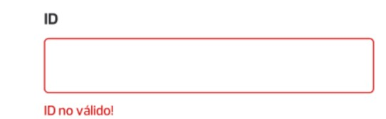
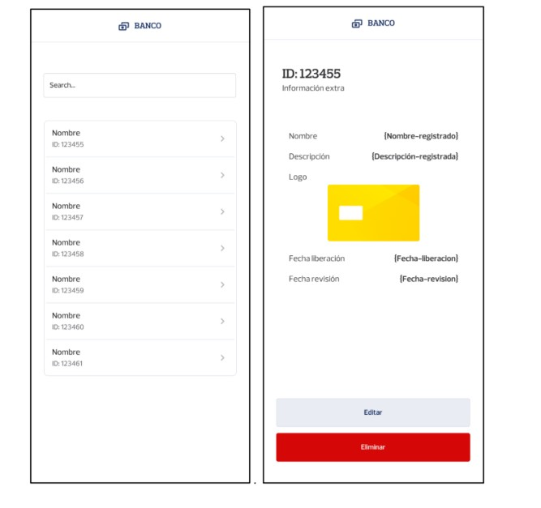
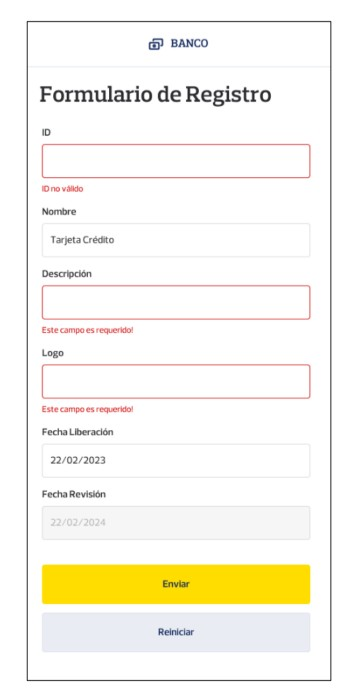
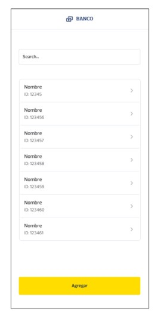
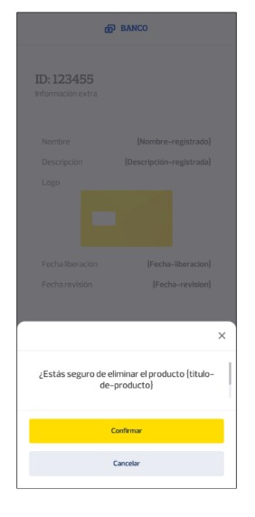

# prueba-tecnica-react-native

## Indicaciones generales

- Aplique todas las buenas prácticas, clean code, SOLID (se tomará en cuenta este punto
para la calificación).
- Se debe realizar el UI Develoment (Maquetación) sin usar frameworks de estilos o
componentes prefabricados.
- Se debe manejar excepciones y mostrar mensajes de errores visuales.
- Se debe realizar pruebas unitarias y contar con un mínimo de 70% coverage.
- Posterior a la entrega de este ejercicio, se estará agendando una entrevista técnica
donde el candidato deberá defender la solución planteada.

> Nota: Los servicios necesarios a consumir para este proyecto son locales. Más adelante se detallará la manera de hacerlo.


## Herramientas y tecnologías utilizadas

- React Native
- React
- TypeScript
- Pruebas unitarias de preferencia con Jest.


## Funcionalidades del Frontend

### F1 Listado de productos financieros:

Se requiere una aplicación para visualizar los diferentes productos financieros ofertados por un
Banco cargados de una API. Realizar la maquetación en base al diseño D1. Al seleccionar un item,
se mostrará toda la información de dicho item en otra vista.

### F2. búsqueda de productos financieros:

Se requiere realizar búsqueda de los productos financieros mediante un campo de texto. Realizar
la maquetación en base al diseño D1.

### F3. Cantidad de registros:

Se requiere mostrar un listado de los registros obtenidos. Realizar la maquetación en base al
diseño D1.

### F4. Agregar producto:

Se requiere la implementación un botón de “Agregar” para navegar al formulario de registro, el
formulario debe permitir la creación de un producto mediante un botón “Agregar” y debe
permitir la limpieza del formulario mediante un botón de “Reiniciar”. Realizar la maquetación del
formulario base al diseño D2 y de la ubicación del botón principal en base a diseño D3.
Cada campo del formulario contendrá su respectiva validación previa al envío del formulario:

| **Campo**               | **Validación** |
|--------------------------|----------------|
| **Id**                   | - Requerido, mínimo 3 caracteres y máximo 10, validación de ser un Id que no exista mediante el consumo del servicio de verificación. |
| **Nombre**               | - Requerido, mínimo 5 caracteres y máximo 100 |
| **Descripción**          | - Requerido, mínimo 10 caracteres y máximo 200 |
| **Logo**                 | - Requerido |
| **Fecha de Liberación**  | - Requerido, la Fecha debe ser igual o mayor a la fecha actual |
| **Fecha de Revisión**    | - Requerido, la Fecha debe ser exactamente un año posterior a la fecha de liberación |


En caso de no cumplirse con alguna de las validaciones se deberá mostrar visualmente al usuario
el estado de error de cada campo, de la siguiente manera:

<p align="center">

</p>


### F5. Editar producto:

Se requiere un botón que al realizar clic en el permita editar el producto, al hacer clic se deberá
navegar a la pantalla de edición del producto y debe mantener el campo de ID deshabilitado, el
formulario de editar debe mantener las mismas validaciones de la funcionabilidad F4 y mostrar
errores por cada campo. Realizar la maquetación del formulario de edición en base al diseño D2.

> Diseño D1

<p align="center">
    
</p>

> Diseño D2

<p align="center">
    
</p>

> Diseño D3

<p align="center">
    
</p>


> Diseño D4

<p align="center">
    
</p>


> Documentación

| **Clave**        | **Tipo** | **Valor de ejemplo** | **Descripción** |
|------------------|----------|----------------------|-----------------|
| **id**           | String   | trj-crd              | Identificador único del producto. |
| **name**         | String   | Tarjetas de Crédito  | Nombre del Producto. |
| **description**  | String   | Tarjeta de consumo bajo la modalidad de crédito | Descripción del Producto. |
| **logo**         | String   | https://www.visa.com.ec/dam/VCOM/regional/lac/SPA/Default/Pay%20With%20Visa/TarjetasVisa-signature-400x225.jpg | Url de un logo representativo para el producto |
| **date_release** | Date     | 2023-02-01           | Fecha a liberar el producto para los clientes en General |
| **date_revision**| Date     | 2024-02-01           | Fecha de revisión del producto para cambiar Términos y Condiciones |

## Servicios

Los servicios por consumir serán de manera local. Tendrá que correr un proyecto backend
realizado con Node.js.
Para hacerlo debe seguir los siguientes pasos:

1. Descomprimir el archivo repo-interview-main.zip.
2. Abrir un terminal apuntando a la carpeta descomprimida.
3. Instalar las dependencias con npm install.
4. Correr el proyecto con el comando npm run start:dev
5. Se abrirá el servicio en el puerto http://localhost:3002

> Url base:
http://localhost:3002

### OBTENER PRODUCTOS FINANCIEROS

| **Campo**     | **Valor** |
|---------------|------------|
| **URL**       | `/bp/products` |
| **METHOD**    | `GET` |
| **EXAMPLE**   | `http://localhost:3002/bp/products` |
| **RESPONSES** |             |

 
**Code** 200
**Description** 

 ```json
 {
  data": [
    {
      "id": "uno",
      "name": "Nombre producto",
      "description": "Descripción producto",
      "logo": "assets-1.png",
      "date_release": "2025-01-01",
      "date_revision": "2025-01-01"
    }
  ]
 }
```

### CREAR PRODUCTOS FINANCIEROS

| **Campo**     | **Valor** |
|---------------|------------|
| **URL**       | `/bp/products` |
| **METHOD**    | `POST` |
| **EXAMPLE**   | `http://localhost:3002/bp/products` |

> REQUEST

**Json body**

```javascript
 {

"id": "dos",
"name": "Nombre producto",
"description": "Descripción producto",
"logo": "assets-1.png",
"date_release": "2025-01-01",
"date_revision": "2025-01-01"
}
```

> RESPONSES

**Code** 200

**Description**

```javascript
{
"message": "Product added successfully",
"data": {
"id": "dos",
"name": "Nombre producto",
"description": "Descripción producto",
"logo": "assets-1.png",
"date_release": "2025-01-01",
"date_revision": "2025-01-01"
}
}
```

**Code** 400

**Description**

```javascript
{

"name": "BadRequestError",
"message": "Invalid body, check 'errors' property for more info.",
...
}
```

### ACTUALIZAR PRODUCTO FINANCIERO

| **Campo**     | **Valor** |
|---------------|------------|
| **URL**       | `/bp/products/:id` |
| **METHOD**    | `PUT` |
| **EXAMPLE**   | `http://localhost:3002/bp/products/uno` |
| **REQUEST**   |             |

> REQUEST

**Json Body**

```javascript

{

"name": "Nombre actualizado",
"description": "Descripción producto",
"logo": "assets-1.png",
"date_release": "2025-01-01",
"date_revision": "2025-01-01"
}
```
> RESPONSES

**Code:** 200

**Description**

```javascript
{

"message": "Product updated successfully",
"data": {
"name": "Nombre actualizado",
"description": "Descripción producto",
"logo": "assets-1.png",
"date_release": "2025-01-01",
"date_revision": "2025-01-01"
  }
}
```

**Code:** 404

**Description**

```javascript
{

"name": "NotFoundError",
"message": "Not product found with that identifier",
...
}

```

### ELIMINAR PRODUCTOS FINANCIEROS

| **Campo**     | **Valor** |
|---------------|------------|
| **URL**       | `/bp/products/:id` |
| **METHOD**    | `DELETE` |
| **EXAMPLE**   | `http://localhost:3002/bp/products/dos` |
| **REQUEST**   |             |

> PARAMS
id - dos

> RESPONSES

**Code:** 200

**Description**

```javascript
{

"message": "Product removed successfully"
}
```

**Code:** 404

**Description**

```javascript
{

"name": "NotFoundError",
"message": "Not product found with that identifier",
...
}
```

### VERIFICACIÓN DE EXISTENCIA DE ID

| **Campo**     | **Valor** |
|---------------|------------|
| **URL**       | `/bp/products/verification/:id` |
| **METHOD**    | `GET` |
| **EXAMPLE**   | `http://localhost:3002/bp/products/verification/uno` |

> PARAMS
id - uno

> RESPONSES

| **Code**     | **Description** |
|---------------|------------|
| 200       | true/false (true existe / false no existe) |

## ENTREGRABLES

- La solución debe ser cargado a un repositorio Git público, se debe enviar la ruta de
este repositorio.
- Se debe entregar antes de la fecha y hora indicada por correo.